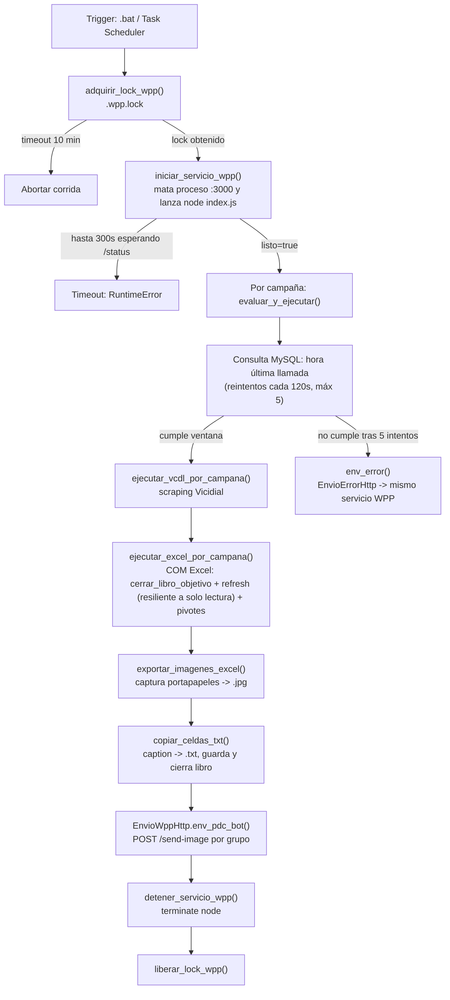

# Arquitectura del proceso de envío PDC (WhatsApp + Cargue a servidor)

> Documento generado a partir de una revisión de `src/`, `whatsapp_service/` y los `.bat` de arranque. Cubre los 4 flujos de envío por WhatsApp (Colas, Colsubsidio, Colsubsidio Atracción, TrueBlue) y los 2 flujos de cargue al servidor .61 (IA Clarita, Mensajería/SMS Fidelización).

## 1. Resumen ejecutivo

El pipeline reemplazó Selenium por un microservicio Node.js (Baileys) para el envío de WhatsApp, con un puente HTTP desde Python. El diseño ya incorpora buenas prácticas (candado entre procesos, reintentos, logging persistente, token de autenticación, `.env` fuera de git). La revisión inicial identificó 5 riesgos de severidad alta; se detallan en la sección 4 junto con su estado.

> **Actualización 2026-08-04:** se revisaron los `logs/` reales de producción, lo que aportó dos correcciones importantes al análisis inicial:
> - El riesgo #1 (`kill_excel` cerraba todo Excel) tenía una causa raíz confirmada por los logs: un fallo real ese mismo día donde el libro de la campaña "Colas" estaba tomado desde la unidad de red `Z:` y la corrida no envió nada. Esto llevó a corregir tanto el cierre indiscriminado como la resiliencia de apertura — ver #1 más abajo.
> - El riesgo #4 (candado no cubre Excel) era **incorrecto**: `.wpp.lock` se adquiere antes de la fase de Excel y se libera al final, así que sí la cubre. Las corridas duran ~90s y están escalonadas; no hay un solo mensaje de contención en los logs. Se corrigió su severidad.
>
> Con esa evidencia se aplicaron correcciones de código a los ítems #1, #5, #7, #11 y #12 (ver columna **Estado** en cada tabla).

## 2. Flujo end-to-end

Los 2 mains de cargue (`main_load_IA_Clarita_fidelizacion.py`, `main_load_mensajeria_fidelizacion.py`) son independientes de este flujo: leen `data/Bases_*/Nuevo/*.xlsx`, deduplican contra la tabla destino por `(fecha_envio, cuenta, servicio)`, insertan con `to_sql` en chunks de 5000, y mueven los archivos a `Cargado/`.

## 3. Inventario de componentes

| Componente | Archivo | Responsabilidad |
|---|---|---|
| Servidor WhatsApp | `whatsapp_service/index.js` | Express + token `x-api-token`, expone `/status`, `/send-image`, `/send-text`, `/list-chats` |
| Cliente Baileys | `whatsapp_service/wpp_client.js` | Conexión WebSocket a WhatsApp Web, cache de grupos en disco, reconexión automática, borrado de sesión si es inválida |
| Log persistente Node | `whatsapp_service/logger.js` | Espeja consola a `logs/wpp_service_YYYY-MM-DD.log`, retención 7 días |
| Puente HTTP Python | `src/excel_app/_cls_envio_wpp_http.py` | `EnvioWppHttp` (imágenes) y `EnvioErrorHttp` (alertas), 3 reintentos con backoff `[4,10]` |
| Candado inter-proceso | `src/excel_app/_cls_wpp_lock.py` | Archivo `.wpp.lock` con PID; libera automáticamente si el PID dueño ya no existe |
| Log persistente Python | `src/excel_app/_cls_wpp_logger.py` | Tee de stdout/stderr a `logs/{campana}_YYYY-MM-DD.log`, retención 7 días |
| Automatización Excel | `src/excel_app/_cls_excel_auto_manager.py` | `Process_Excel`: ejecuta SPs, `cerrar_libro_objetivo` (solo el libro de la campaña), refresh COM con fallback a solo lectura, captura de imágenes con detección de contaminación del portapapeles |
| Orquestador por campaña | `src/_main_*_process_excel_pdc.py` (4 archivos) | Arranca/detiene el servicio Node, evalúa ventana de tiempo, encadena VCDL → Excel → envío |
| Cargue IA Clarita | `src/main_load_IA_Clarita_fidelizacion.py` | Cargue incremental a `bbdd_cos_bog_claro_fidelizacion.tb_ia_clarita_fidelizacion_ds` |
| Cargue Mensajería/SMS | `src/main_load_mensajeria_fidelizacion.py` | Cargue incremental a `bbdd_cos_bog_claro_fidelizacion.tb_sms_fidelizacion_ds` |
| Conexión DB | `src/conexiones_db/_cls_sqlalchemy.py` | `MySQLConnector.get_connection()`, crea un `Engine` SQLAlchemy nuevo por llamada |

Los 4 orquestadores (`colas`, `colsubsidio`, `colsubsidio_atraccion`, `trueblue`) son **copias casi idénticas** (confirmado por diff): mismo flujo, mismas funciones, y solo cambian el nombre de campaña, el `.env` (trueblue usa `.env.trueblue`, conexión a otro servidor) y el `intervalo_max` (80 / 300 / 300 / 100 minutos respectivamente, sin comentario que explique el porqué de cada valor).

## 4. Matriz de incidencias / riesgos

### Severidad alta

| # | Estado | Riesgo | Dónde | Impacto | Recomendación / corrección aplicada |
|---|---|---|---|---|---|
| 1 | 🟢 **Resuelto (2026-08-04)** | `kill_excel()` terminaba **todas** las instancias de `EXCEL.EXE` de la máquina. **Motivo de diseño original (confirmado):** `CopyPicture` + `ImageGrab.grabclipboard()` dependen del portapapeles de Windows, un recurso global; otro Excel copiando algo a mitad de la captura contaminaba la imagen enviada. **Evidencia adicional en logs (2026-08-04, campaña Colas):** `Microsoft Excel no puede obtener acceso al archivo 'Z:\...\pdc_entornos_digitales.xlsm' — Otro programa está usando el archivo`; el `Workbooks.Open()` falló y la campaña no envió nada — cerrar Excel local no ayuda cuando el libro está tomado desde otra máquina en la unidad de red | `_cls_excel_auto_manager.py` | Efecto colateral evitable (pérdida de trabajo ajeno) para resolver un problema de portapapeles, **y además insuficiente** para el caso real observado (archivo en red tomado por otra máquina) | Se reemplazó `kill_excel()` por `cerrar_libro_objetivo()`: detecta si *ese* libro está abierto (archivo centinela `~$`) y cierra solo esa instancia vía COM, sin tocar otros Excel. `refresh_archivo_excel()` ahora reintenta `Workbooks.Open(..., ReadOnly=True)` si la apertura normal falla, en vez de abortar la campaña. La captura de imagen valida `win32clipboard.GetClipboardSequenceNumber()` antes/después de `CopyPicture` y descarta+reintenta si el portapapeles cambió, eliminando el `sleep(5)` que era la ventana de contaminación |
| 2 | 🔴 Abierto (diferido) | Reautenticación de WhatsApp depende de escanear un QR mostrado por consola (`printQRInTerminal`/`qrcode.generate`) | `wpp_client.js:113-119`, `_main_*.py: iniciar_servicio_wpp` | Si la sesión se invalida (logout remoto, límite de dispositivos, ban) durante una corrida desatendida por Task Scheduler, nadie ve el QR; el proceso espera 300s y aborta | Agregar un canal de alerta que **no dependa del propio WhatsApp** (correo vía `outlook_app`, ya existe en el repo pero tiene un bug de `locale` en Windows — ver #16) para notificar "sesión WPP caída, requiere QR". Diferido: requiere definir destinatarios y arreglar ese bug primero |
| 3 | 🔴 Abierto (diferido) | El canal de alerta de error (`EnvioErrorHttp`) usa el **mismo** servicio WhatsApp que puede estar caído | `_cls_envio_wpp_http.py:113-161` | Punto único de falla circular: si el servicio no está listo, ni el envío normal ni la alerta de error salen | Enviar la alerta crítica por un canal alterno (correo) cuando `EnvioWppHttp`/`EnvioErrorHttp` fallen tras sus 3 reintentos. Mismo diferimiento que #2 |
| 5 | 🟢 **Resuelto (2026-08-04)** | `MySQLConnector.get_connection()` creaba un `Engine` SQLAlchemy **nuevo** en cada intento del bucle de reintento (hasta 5 veces cada 120s por campaña) y en `env_error()`, sin `dispose()` | `_main_*.py: evaluar_y_ejecutar` y `env_error` (los 4 orquestadores) | Fuga de conexiones/pools acumulados; en ejecuciones largas o con muchos reintentos puede acercarse al `max_connections` de MySQL | Se envolvió cada uso de `engine` en `try/finally` con `engine.dispose()` inmediatamente después de la consulta, en los 4 archivos `_main_*_process_excel_pdc*.py` |

### Severidad media

| # | Estado | Riesgo | Dónde | Impacto | Recomendación / corrección aplicada |
|---|---|---|---|---|---|
| 6 | 🔴 Abierto | Duplicación de código entre los 4 orquestadores | `src/_main_*_process_excel_pdc*.py` | Cualquier fix debe replicarse manualmente 4 veces; ya hay divergencias no documentadas (`intervalo_max`: 80/300/300/100) | Extraer la lógica común a un módulo compartido, parametrizado por config (campaña, `.env`, ventana de tiempo). Fuera de alcance de esta iteración |
| 7 | 🟢 **Resuelto (2026-08-04)** | Inconsistencia entre los 2 mains de cargue: `main_load_IA_Clarita_fidelizacion.py` deduplicaba internamente con `drop_duplicates(subset=LLAVE)` antes de insertar; `main_load_mensajeria_fidelizacion.py` **no lo hacía** | `filtrar_nuevos()` en ambos archivos | Si un Excel de SMS traía filas repetidas con la misma llave, se insertaban duplicadas en `tb_sms_fidelizacion_ds` | Se añadió el mismo `drop_duplicates(subset=LLAVE)` (con su log de duplicados eliminados) en `main_load_mensajeria_fidelizacion.py` |
| 8 | 🔴 Abierto | Los 2 mains de cargue no tienen candado/lock; la deduplicación se basa en leer llaves existentes antes de insertar (TOCTOU) | `main_load_*_fidelizacion.py` | Si se disparan dos veces en paralelo (manual + programado), ambos pueden ver el mismo set de llaves "nuevas" antes de que el otro inserte → duplicado | Agregar candado de archivo simple (igual patrón que `_cls_wpp_lock.py`) y/o una constraint `UNIQUE` en MySQL sobre `(fecha_envio, cuenta, servicio)` como defensa adicional |
| 9 | 🔴 Abierto | `exportar_imagenes_excel()` reintenta 5 veces por hoja, pero si todas fallan solo **loguea y continúa** sin abortar el run ni disparar alerta específica | `_cls_excel_auto_manager.py` | El envío de WhatsApp puede salir sin una imagen y nadie se entera salvo revisando el log manualmente | Acumular fallos de captura y, si hay al menos uno, enviar una alerta (vía `EnvioErrorHttp` o correo) antes de continuar |
| 10 | 🔴 Abierto | Timing basado en `time.sleep()` fijos (8s, 10s, 30s) en vez de esperas por estado real de Excel | `_cls_excel_auto_manager.py` (refresh, captura) | En máquina más lenta o bajo carga, aumenta la tasa de reintentos/fallos intermitentes | Ya está parcialmente mitigado con `esperar_excel_listo` y `_com_retry`, y esta iteración eliminó el `sleep(5)` más riesgoso (ver #1); extender el resto cuando se detecten fallos recurrentes en logs |
| 11 | 🟢 **Resuelto (2026-08-04)** | Nombre de archivo con espacio antes de la extensión: `_main_what_colas_process_excel_pdc .py` | `src/` y referenciado literal en `01_PDC_COLAS_WHAT.bat` | Frágil ante copias/renombres manuales; fácil de romper el `.bat` sin notarlo | Renombrado a `_main_what_colas_process_excel_pdc.py` (`git mv`) y actualizada la ruta en `01_PDC_COLAS_WHAT.bat` en el mismo cambio |

### Severidad baja

| # | Estado | Riesgo | Dónde | Impacto | Recomendación / corrección aplicada |
|---|---|---|---|---|---|
| 4 | ℹ️ **Corregido en el análisis** | *(Reclasificado desde severidad alta)* Se creía que el candado `.wpp.lock` no cubría la fase de Excel, solo el envío WhatsApp. **Verificado como incorrecto:** el candado se adquiere antes de `iniciar_servicio_wpp()` y se libera al final de todo el `try/finally` del main, así que **sí cubre Excel**. Las corridas duran ~90s (medido en `logs/wpp_service_*.log`) y están escalonadas (:12 y :30 de cada hora); no hay un solo mensaje `[WPP-LOCK]` de contención en los logs revisados | `_cls_wpp_lock.py`, sección `__main__` de los 4 orquestadores | Ninguno — no era un riesgo real | Sin acción. Se deja como nota para no reabrir la duda en el futuro |
| 12 | 🟢 **Resuelto (2026-08-04)** | Dependencia de Baileys (librería no oficial de WhatsApp Web) fijada con caret sobre un release candidate: `"@whiskeysockets/baileys": "^7.0.0-rc13"` | `package.json` | `npm install` futuro podría traer un RC más nuevo con cambios de comportamiento sin control | Se fijó la versión exacta (`7.0.0-rc13`, sin `^`) en `package.json` y se regeneró `package-lock.json` (`npm install --package-lock-only`) |
| 13 | 🔴 Abierto | Toda la automatización depende de una sesión de escritorio interactiva de Windows con Excel con licencia (no es un servicio real) | `_cls_excel_auto_manager.py` (COM), `.bat` con `@ECHO ON` | Reinicios, actualizaciones de Windows, o pérdida de auto-logon detienen todo el pipeline sin aviso proactivo | Documentar el requisito operativo explícitamente (ya cubierto en parte por este documento); considerar monitoreo externo del Task Scheduler |
| 14 | 🔴 Abierto | IP de servidor hardcodeada en el mensaje de alerta (`172.70.7.61`) | `_cls_envio_wpp_http.py:127` | Bajo riesgo, pero acopla infraestructura al código fuente | Mover a config/`.env` si el servidor puede cambiar |
| 15 | 🔴 Abierto | `CALL {nombre}({placeholders})` construido con f-string en `ejecutar_sps()` | `_cls_excel_auto_manager.py` | Hoy `nombre` viene de `config_pdc.json` local y confiable, riesgo real bajo; pero es un patrón de SQL dinámico a vigilar si ese config se vuelve editable por terceros | Sin acción urgente; documentar que `nombre` de SP nunca debe derivarse de input externo |
| 16 | 🔴 Abierto (hallazgo nuevo) | `src/outlook_app/_cls_send_correo_outlook.py` ejecuta `locale.setlocale(locale.LC_TIME, 'es_ES.UTF-8')` a nivel de módulo; ese identificador de locale es de Linux/macOS y **no existe en Windows** (allí sería `Spanish_Spain`), donde corre todo este pipeline | `_cls_send_correo_outlook.py:11` | Cualquier intento de usar este módulo (p. ej. como canal alterno de alertas, ver #2/#3) fallaría al importarlo con `locale.Error`. Hoy nadie lo usa, así que el bug está latente y sin detectar | Corregir el locale antes de adoptar este módulo como canal de alertas |

## 5. Recomendaciones priorizadas

**✅ Aplicado en esta iteración (2026-08-04):**
- #1 Cierre dirigido al libro de la campaña + apertura resiliente en solo lectura + detección de contaminación del portapapeles (`_cls_excel_auto_manager.py`). Este era el cambio de mayor impacto: corrige tanto el daño a Excel ajeno como el fallo real observado en logs (campaña Colas sin enviar por libro tomado en red).
- #5 `engine.dispose()` en los 4 orquestadores, evitando la fuga de conexiones MySQL.
- #7 Deduplicación interna añadida en `main_load_mensajeria_fidelizacion.py`, igualando el comportamiento de `main_load_IA_Clarita_fidelizacion.py`.
- #11 Archivo renombrado (sin el espacio) y `.bat` actualizado en el mismo cambio.
- #12 Versión de Baileys fijada sin `^` y `package-lock.json` regenerado.
- Se eliminó además la clase `EjecucionStoredProcedure` duplicada y sin uso dentro de `_cls_excel_auto_manager.py` (la versión canónica vive en `src/sql_stored_procedure/_cls_ejecucion_sp.py`).

**Pendiente — diferido por decisión explícita (requiere definir destinatarios y arreglar `outlook_app` primero):**
- #2 y #3: Canal de alerta alterno a WhatsApp (correo) para no depender del mismo canal que puede estar caído.
- #16: Arreglar el `locale.setlocale` de `outlook_app` antes de poder usarlo como ese canal alterno.

**Pendiente — fuera de alcance de esta iteración:**
- #6: Refactorizar los 4 orquestadores duplicados a un módulo común parametrizado por campaña.
- #8, #9, #10, #13, #14, #15: ver detalle y recomendación en la matriz de la sección 4.

**Sin acción necesaria:**
- #4: Reclasificado tras revisar logs — el candado sí cubre la fase de Excel y no hay evidencia de contención. No era un riesgo real.
